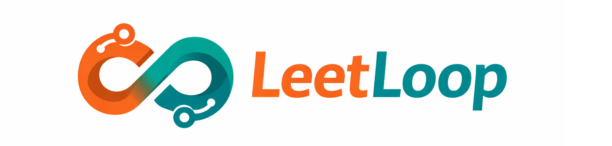
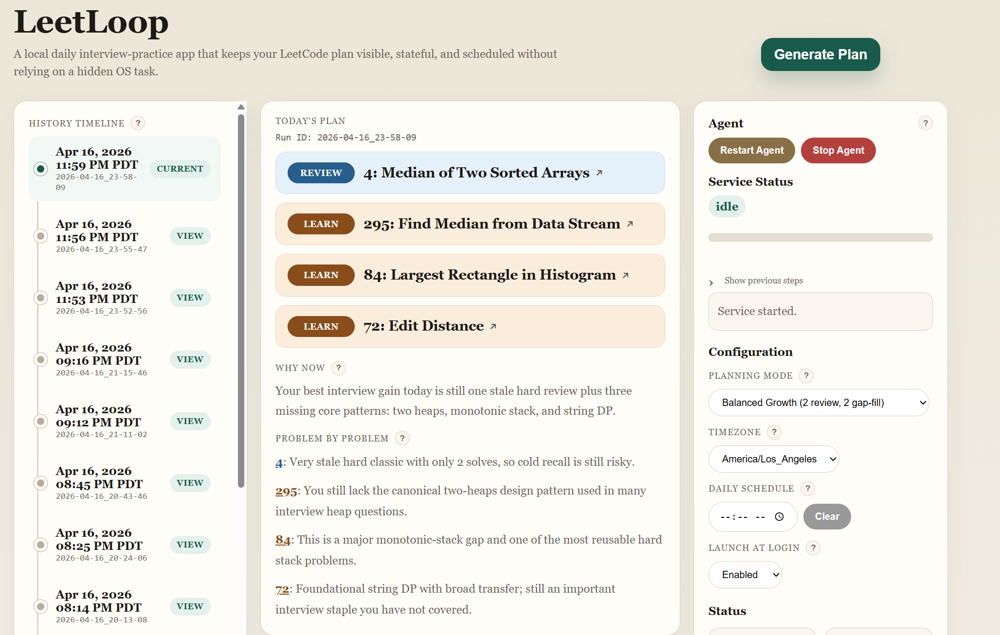
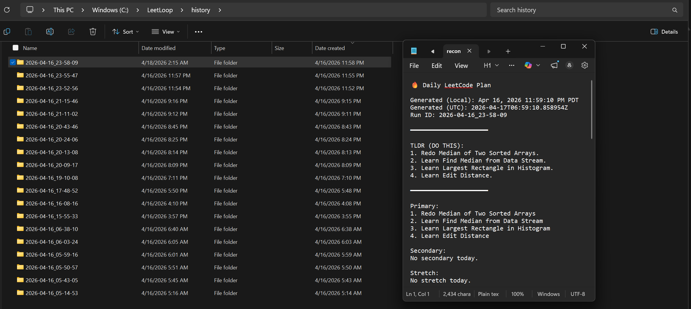

# LeetLoop

LeetLoop is a **local-first decision system for interview preparation**, designed to turn LeetCode practice into a structured, data-driven feedback loop.

Rather than manually tracking progress, LeetLoop ingests solved problems, analyzes patterns, and generates adaptive study plans while preserving full transparency through inspectable artifacts.

Built as a **closed-loop system**, where each run updates a persistent dataset of solved problems, enabling adaptive scheduling and continuous improvement.  

Has LeetLoop helped you land an offer? Spotted any issues? Connect with me at https://www.linkedin.com/in/arsh-bansal1/ and share your thoughts!

For new users, here's what to expect:

- Python planning pipeline and local browser app
- rule-based evidence generation combined with model-driven planning
- saved run artifacts for debugging and iteration
- cross-platform source setup for technical users
- PyInstaller build path for a future desktop-style release

---

## For Developers

LeetLoop is an applied software project at the intersection of:

- product engineering
- local-first developer tooling
- recommendation systems
- authenticated API integration
- LLM-assisted workflow design

The main technical idea is not "ask GPT what LeetCode problem to do." It is:

1. collect reliable evidence from a user's actual LeetCode history
2. turn that evidence into structured signals like stale mastery, category coverage, and recent recommendation memory
3. let the model make the planning tradeoffs from that evidence
4. preserve each run as inspectable output for debugging and iteration

All developers are encouraged to iterate on this concept.

---

## Technical Highlights

- Python application with a local web UI backed by `ThreadingHTTPServer`
- Authenticated LeetCode GraphQL ingestion for solved-problem history
- OpenAI Responses API integration for final recommendation generation
- Local scheduler and browser-based configuration flow
- Structured planning artifacts such as `snapshot.json`, `prompt.txt`, and `candidate_buckets.json`
- Cross-platform setup scripts for Windows, macOS, and Linux
- Lightweight GitHub Actions CI and PyInstaller build infrastructure

---

## Tech Stack

- Language: Python 3.10+
- HTTP / UI server: Python `http.server` with `ThreadingHTTPServer`
- External APIs: LeetCode GraphQL, OpenAI Responses API
- Core libraries: `requests`, `python-dotenv`, `tzdata`
- Packaging: PyInstaller
- Automation: shell / batch setup scripts, built-in local scheduler
- CI: GitHub Actions (In Development)

---

## Demo

### Dashboard


### Run History


### Early Usage Signals

- Tested pre-release personally for 2 weeks as a daily interview-prep tool
- Pre-beta tested by 22 users
- Designed to retain a rolling memory of recent progress so recently studied gaps get a short retention break instead of being recommended again immediately

### Early Feedback

Paraphrased from early testers:

- "It does a good job of remembering what I worked on recently instead of telling me to grind the same weak area every day."
- "The recommendations feel more structured than just picking random LeetCode 150 problems."
- "It recommended me problems I have technically solved before, but I realized I wasn't comfortable with them when I retried them."

---

## Requirements

- Python 3.10+
- OpenAI API key
- LeetCode session cookies:
  - `LEETCODE_SESSION`
  - `LEETCODE_CSRFTOKEN`

## Notes

- Local-first app
- Browser-based UI
- Source install is currently the recommended path
- macOS/Linux setup is terminal-based and currently best suited to technical users

---

## What It Does

- Fetches solved problem history from LeetCode
- Tracks when you last solved each problem and how many times
- Detects changes between runs
- Preserves recommendation history across runs through the local `history/` folder
- Applies cooldown rules so problems you just solved are not immediately recommended again
- Supports different planning styles depending on your goal
- Outputs both a readable plan and structured artifacts for debugging and analysis

---

## Architecture

LeetLoop is built as a small local application with a Python planning pipeline and a browser UI.

### Core flow

1. Pull solved problems from LeetCode
2. Build a fresh snapshot of the user's current solve history
3. Compare it with the previous snapshot to detect activity
4. Compute structured evidence:
   - stale / low-count review opportunities
   - unsolved gap-fill candidates
   - category coverage summaries
   - recent recommendation memory
5. Send that evidence to the OpenAI Responses API to choose the final session and explain it
6. Save all run artifacts locally for inspection

### Main modules

- [src/run_pipeline.py](C:\LeetLoop\src\run_pipeline.py)
  Core planning pipeline: LeetCode fetch, evidence generation, OpenAI prompt construction, validation, and artifact output.

- [src/run_service.py](C:\LeetLoop\src\run_service.py)
  Local browser UI, scheduler, settings handling, and run orchestration built on Python's `http.server`.

- [src/app_launcher.py](C:\LeetLoop\src\app_launcher.py)
  Packaged-app entry point and first-run setup path for PyInstaller builds.

- [config/config.json](C:\LeetLoop\config\config.json)
  Planner behavior tuning such as planning bias and candidate logic.

- [config/app_config.json](C:\LeetLoop\config\app_config.json)
  Local app behavior such as host, port, browser launch, and schedule.

---

## Recommended Usage

The recommended way to use LeetLoop is as a small local app.

The app:

- shows the latest recommendation in a browser
- lets you trigger a run manually
- keeps a daily run time in local config
- runs the planner on a built-in schedule instead of a hidden OS task
- keeps state, credentials, and recommendation history on your own machine

---

## Planning Modes

- `balanced_growth`
  Mix of review and new problems

- `interview_maintenance`
  Heavier on review and retention

- `aggressive_gap_fill`
  More weight on missing patterns and new learning

---

## Project Structure

```text
LeetLoop/
|-- src/
|   |-- run_pipeline.py         # Core planner logic
|   |-- run_service.py          # Web UI server and background agent
|   `-- app_launcher.py         # Entry point for bundled executable
|-- build_scripts/
|   |-- build.py                # PyInstaller build script
|   `-- README.md               # Build instructions
|-- config/
|   |-- config.json             # Planner configuration
|   `-- app_config.json         # Local app defaults
|-- examples/
|   |-- sample_snapshot.json
|   |-- sample_recommendation.json
|   |-- sample_candidate_buckets.json
|   `-- sample_plan_memory.json
|-- history/                    # Local run output (gitignored)
|-- setup_windows.bat           # Windows setup (source install)
|-- setup.sh                    # macOS/Linux setup (source install)
|-- run_app.bat                 # Windows app launcher
|-- run_app.sh                  # macOS/Linux app launcher
|-- requirements.txt            # Runtime dependencies
|-- requirements-build.txt      # Build-only dependencies
|-- .env.example
|-- .gitattributes
`-- README.md
```

---

## Setup

### Recommended: Run From Source

Source install is the primary supported path right now.

#### Windows

1. Clone the repository.
2. Run `setup_windows.bat`:

```bat
setup_windows.bat
```

This will:

- require Python 3.10+
- create a local virtual environment
- install Python dependencies
- create `.env` from `.env.example`
- prompt for `OPENAI_API_KEY`
- prompt for `LEETCODE_SESSION`
- prompt for `LEETCODE_CSRFTOKEN`

3. Start the app:

```bat
run_app.bat
```

Optional quick validation before launch:

```bat
.venv\Scripts\python.exe src\run_service.py --check-setup
```

#### macOS / Linux

1. Clone the repository.
2. Open a terminal in the repo and run:

```bash
chmod +x setup.sh
./setup.sh
```

This will:

- require Python 3.10+
- create a local virtual environment
- install Python dependencies
- create `.env` from `.env.example`
- prompt for `OPENAI_API_KEY`
- prompt for `LEETCODE_SESSION`
- prompt for `LEETCODE_CSRFTOKEN`

3. Start the app:

```bash
chmod +x run_app.sh
./run_app.sh
```

Optional quick validation before launch:

```bash
.venv/bin/python src/run_service.py --check-setup
```

### Optional Packaged Launcher

The packaged launcher exists as a secondary path, but source install is still the documented default until the packaged flow is fully proven across platforms.

### Manual Setup (Advanced)

1. Copy `.env.example` to `.env`.
2. Fill in:

- `OPENAI_API_KEY`
- `LEETCODE_SESSION`
- `LEETCODE_CSRFTOKEN`

3. Install dependencies:

```bash
python3 -m venv .venv
source .venv/bin/activate  # or .venv\Scripts\activate on Windows
pip install -r requirements.txt
```

4. Start the app:

```bash
python src/run_service.py --ui
```

Optional quick validation:

```bash
python src/run_service.py --check-setup
```

Or run the planner directly once:

```bash
python src/run_pipeline.py
```

### Building Your Own Executable

Standalone executable builds are a developer workflow, not the primary setup path.

1. Install build dependencies:

```bash
pip install -r requirements-build.txt
```

2. Build the executable:

```bash
python build_scripts/build.py
```

The executable will be created in `dist/`.

---

## Required Environment Variables

`.env.example` contains the required keys:

```dotenv
OPENAI_API_KEY=...
OPENAI_MODEL=gpt-5.4
LEETCODE_SESSION=...
LEETCODE_CSRFTOKEN=...
```

Notes:

- `OPENAI_API_KEY` is required for plan generation
- `LEETCODE_SESSION` and `LEETCODE_CSRFTOKEN` are required for authenticated LeetCode GraphQL access
- `.env` is local-only and must never be committed

---

## Running LeetLoop

### Recommended App Mode

On Windows:

```bat
run_app.bat
```

On macOS / Linux:

```bash
./run_app.sh
```

This starts the local web app and embedded scheduler.

### First-Run Commands

- Windows: `setup_windows.bat` then `run_app.bat`
- macOS/Linux: `./setup.sh` then `./run_app.sh`

### Quick Setup Check

Run this before launching the app if you want a fast validation pass.

On Windows:

```bat
.venv\Scripts\python.exe src\run_service.py --check-setup
```

On macOS / Linux:

```bash
.venv/bin/python src/run_service.py --check-setup
```

It checks:

- Python version
- `.env` presence
- required credentials
- config JSON loading

### Direct Python Entrypoints

Run the app directly:

```bash
python src/run_service.py --ui
```

Run the planner once without the UI:

```bash
python src/run_pipeline.py
```

---

## Daily Automation

LeetLoop supports daily local automation through the built-in app scheduler.

Why this is the recommended model:

- `history/` persists naturally across runs
- credentials stay local in `.env`
- recommendation output remains private
- the schedule is visible inside the app rather than hidden in the OS
- the same app can both display the latest plan and trigger new runs

---

## Output Artifacts

Each run creates a new folder:

```text
history/<run_id>/
```

With:

- `snapshot.json`
- `prompt.txt`
- `recommendation.json`
- `recommendation.txt`
- `plan_memory.json`
- `candidate_buckets.json`

These artifacts make it easy to inspect what evidence existed, what prompt was sent, and what plan came back.

---

## Debugging

If something looks off, start with:

```text
candidate_buckets.json
```

It shows:

- planning mode
- target shape
- candidate pools
- cooldown exclusions
- learning profile summary
- score components for ranked candidates

---

## Design Principles

- Keep sessions small and realistic
- Avoid redoing problems too soon
- Treat old, low-count problems as weak mastery
- Use deterministic Python logic for evidence and guardrails
- Use the model for prioritization and tradeoff decisions
- Keep private user data local by default
- Preserve enough artifacts to debug planner behavior

---

## Security Notes

- `.env` is ignored by Git
- `history/` is ignored by Git
- example files are safe to publish
- do not commit real cookies or API keys

---

## Roadmap

- richer pattern taxonomy and coverage tracking
- stronger recommendation evaluation and comparison tooling
- more polished history analytics and dashboard views
- easier cross-platform packaging
- optional notification and reminder flows

---

## Resume / Portfolio Framing

If you are evaluating this project as portfolio work, the strongest signals are:

- end-to-end product thinking, not just prompt experimentation
- Python application design across data ingestion, scheduling, UI, and planning
- real-world API integration with authenticated LeetCode GraphQL access and OpenAI Responses API usage
- local-first architecture with user data stored on-device
- debuggable model behavior through saved prompts, candidate pools, and run artifacts

---

## Contributing

Feel free to fork and experiment. The project is designed to be understandable, modifiable, and useful as both a tool and a systems project.

---

## License

MIT License
